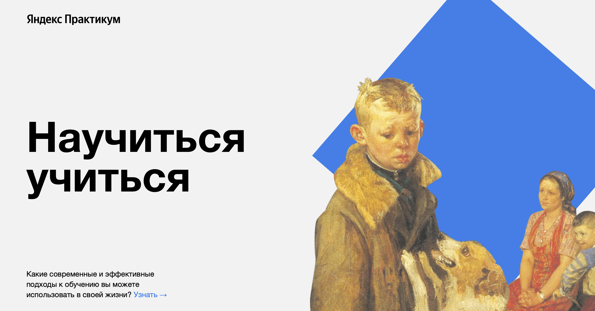

<h1 align="center">Научиться учиться</h1>
<h2 align="center">Первый самостоятельный проект в рамках обучения на Я.Практикуме</h2>

<h2 align="center"> Используемые технологии &#128187;</h2>

- HTML
- CSS

<h2 align="center">Описание проекта &#128444</h2>

Проект представляет собой визуализацию пройденного учебного материала, закрепление изученного. Данная страница рассказывает о различных методах и способах обучения.

<h3 align="center">Данная проектная работа включает в себя:</h3>

* применение основ языков разметок HTML и CSS, в частности:
* расположение элементов с помощтю абсоютного или относительно позиционирования, в зависимости от конкретной цели
* использование flexbox
* вставка изображений, ссылок, анимаций и видео

<h2 align="center"> Инструкция по развертыванию &#128212;</h2>

Хотите попробовать в использовании данный ресурс?

1. Клонируйте данный репозиторий локально
2. Откройте в браузере файл index.html в корневой папке проекта или перейдите по данной ссылке [&#128073;&#128161;](https://mariarez.github.io/how-to-learn/)
3. Наслаждайтесь &#127881;

<h2 align="center"> Планы по доработке проекта &#128221; </h2>

- Ссылки проектной работы дополнить реалиными сайтами
- Адаптировать блоки и элементы страницы под различные разрешения (большие экраны, планшеты, мобильные телефоны)
- Найти и добавить альтернативные видео на тему данной проектной работы
- Дописать вендорные префиксы для возможности работы проектна на различных браузерах;
- Создать форму для возможности отправки комментариев пользователями

<h2 align="center"> Дополнительная информация &#128222;</h2>

- [Ссылка на проектную работу](https://mariarez.github.io/how-to-learn/)
